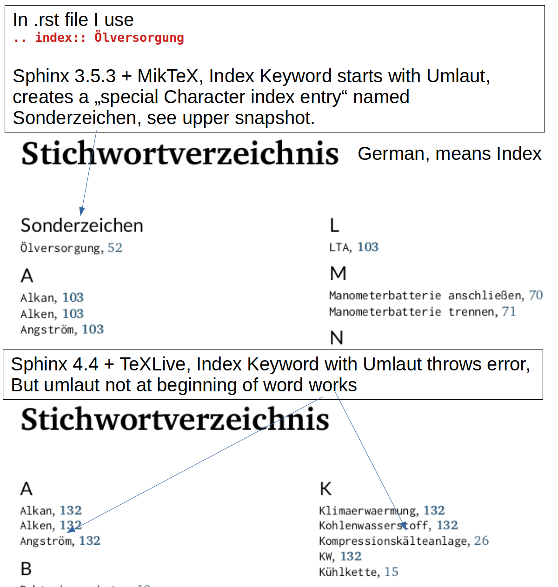

.. include:: ../library/allgemein/thermosymbole.rst

A KAPITEL 1 NAME
****************

Sphinx 3.5 Miktex vs Sphinx 4.4 Texlive 
==========================================

.. index:: Ölversorgung

   Issue with Umlaut Index

A.B.C UnterUnterKapitel 1 Name
------------------------------

.. index:: bad structure

A.B.C.D UnterUnterUnterKapitel 1 Name
^^^^^^^^^^^^^^^^^^^^^^^^^^^^^^^^^^^^^

.. index:: structure even worse

A.B.C.D.E UnterUnterUnterKapitel 1 Name
"""""""""""""""""""""""""""""""""""""""

